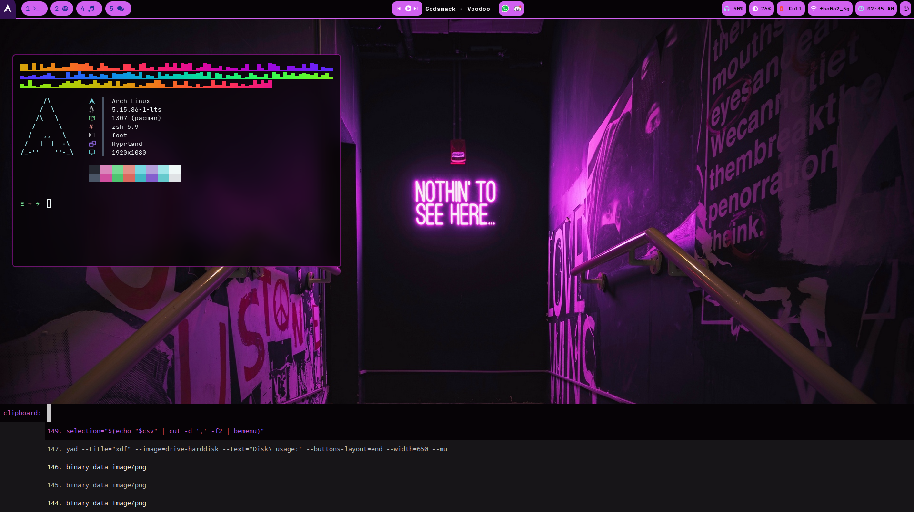
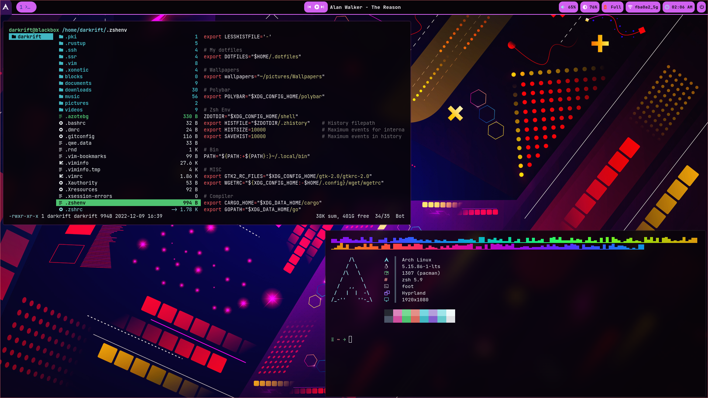

# Dotfiles
- A collection of my configuration files for Arch Linux.
- My main setup is [Arch Linux](https://wiki.archlinux.org/title/Arch_Linux) running on AMD Ryzen 7 5700U (16-core)
- I primarily use [Hyprland Wayland](https://github.com/hyprwm/Hyprland) as my [Window Manager](https://wiki.archlinux.org/title/window_manager)
<br></br>

<br></br>

<br></br>
## 📦 setup
### 💾 Installation:
This setup instructions only provided for Arch Linux (and other Arch-based distributions) 
<br></br>
<b>1. We need to deploy yay and git:</b>

```sh
pacman -S --needed git base-devel && \
git clone https://aur.archlinux.org/yay.git /tmp/yay \
&& cd /tmp/yay && makepkg -si
```

<b>2. Install Window Manager Hyprland Wayland and Waybar:</b>

```sh
yay -S hyprland-git waybar-hyprland-git xdg-desktop-portal-hyprland-git 
```

<b>3. Install necessary packages</b>

```sh
yay -S foot kitty swww swayidle gtklock mako wl-clipboard grim \
slurp mpd mpv mpc xfce-polkit wofi wlogout imagemagick \
ranger wf-recorder xorg-xwayland wdisplays nwg-look-bin \
neovim rofi-calc light xorg-xbacklight sxiv azote yad \
pulsemixer 
```
