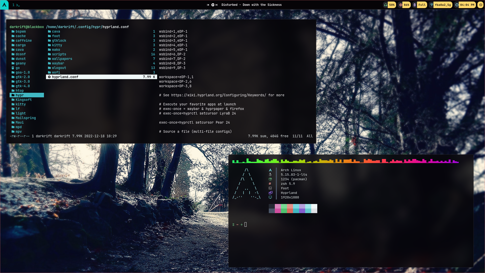
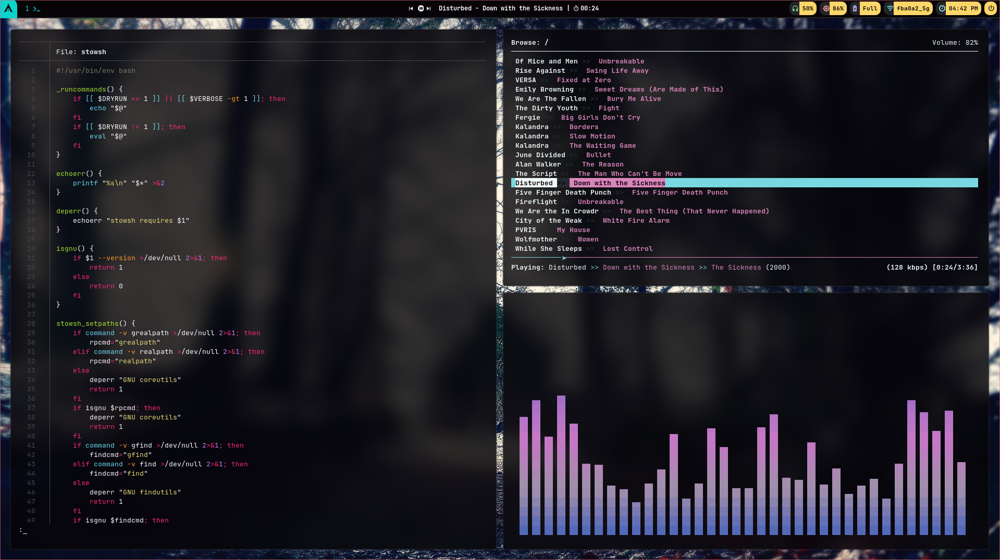

# Dotfiles
A collection of my configuration files for Arch Linux.
My main setup is Arch Linux running on AMD Ryzen 7 5700U (16-core)
I primarily use the [Hyprland Wayland](https://github.com/hyprwm/Hyprland)

